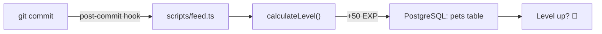

<div align="center">

# 👾 Devgotchi

### The virtual pet that lives inside your codebase

*A digital companion that levels up when you commit, gets moody about bad code, and dresses for the Bangkok weather.*

[](https://bun.com)
[](https://www.typescriptlang.org/)
[](https://www.postgresql.org/)
[](https://orm.drizzle.team/)
[](https://modelcontextprotocol.io/)

</div>

---

## 🐣 What is this?

Devgotchi is a **virtual pet that runs on your development workflow**. Every commit feeds it. Clean code makes it happy. Buggy code makes it complain. It even checks the weather in Bangkok through a live MCP tool and changes outfits accordingly.

Under the hood it's a small stack of real dev tools tied together for fun: a Postgres database tracking pet state, a git hook that feeds it on every commit, and an MCP weather server plugged into an AI agent persona (`@DevgotchiBrain`) that reacts to your code quality.

> 💬 *"Clean code! Tastes like premium RAM."* — @DevgotchiBrain, probably

---

## ✨ Features

| Feature | Description |
|---|---|
| 🍖 **Commit-fed leveling** | Every `git commit` feeds the pet +50 EXP via a post-commit hook |
| 📈 **Level & EXP system** | Pure, property-tested leveling logic — level never decreases, EXP always wraps at 100 |
| 🌤️ **Live weather sync** | An MCP tool fetches real-time Bangkok weather and swaps the pet's outfit (hoodie ☀️ vs. winter gear ❄️) |
| 🧠 **AI agent persona** | `@DevgotchiBrain` — a sarcastic, code-quality-obsessed digital companion defined as a Kiro agent |
| 🗄️ **Real database** | Pet state (level, EXP, outfit) persisted in PostgreSQL via Drizzle ORM |
| 🧪 **Property-based tests** | Leveling math verified with `fast-check` across thousands of generated inputs |

---

## 🛠️ Tech Stack

```
Runtime      Bun
Language     TypeScript (strict — no `any` allowed)
Database     PostgreSQL + Drizzle ORM
Protocol     Model Context Protocol (MCP)
Testing      bun:test + fast-check (property-based testing)
Automation   Git hooks (post-commit, pre-push)
```

---

## 🚀 Getting Started

### 1. Install dependencies

```bash
bun install
```

### 2. Spin up the database

```bash
docker-compose up -d
```

### 3. Push the schema

```bash
bunx drizzle-kit push
```

### 4. Run the agent dashboard

```bash
bun run scripts/run-agent.ts
```

You should see something like this pop up in your terminal:

```
╔═════════════════════════════════════════════════════════════════════════╗
║ 👾 DEVGOTCHI VIRTUAL COMPANION OS v2.0.0   [Agent: @DevgotchiBrain]     ║
╠═════════════════════════════════════════════════════════════════════════╣
║                                                                         ║
║          ⚡ [SYSTEM ONLINE] ⚡                                          ║
║          ╔═══════════╗                                                 ║
║          ║  ●     ●  ║  ✨      *vibing to clean code*                 ║
║          ║     ▽     ║                                                 ║
║          ╚═══════════╝                                                 ║
║                                                                         ║
║ ► STATS & GROWTH                                                       ║
║   • Level       : LVL 1                                                ║
║   • Growth Rate : █████████████░░░░░░░░░░░░░ 50/100 EXP                ║
║                                                                         ║
║ ► TELEMETRY (MCP Protocol · Open-Meteo API)                            ║
║   • Location    : Bangkok, Thailand 🇹🇭                                 ║
╚═════════════════════════════════════════════════════════════════════════╝
```

### 5. Feed it manually (optional)

```bash
bun run scripts/feed.ts
```

---

## 🎮 How Feeding Works



Every successful commit runs the `Feed Pet on Commit` hook, which adds 50 EXP to the pet and levels it up automatically once EXP crosses 100 — reset to 0, level +1, repeat.

---

## 🧪 Testing

Leveling logic is verified with property-based tests, not just fixed examples:

```bash
bun test
```

This checks invariants like *"level never decreases"* and *"EXP always stays within 0–99"* across thousands of randomly generated inputs via `fast-check`.

---

## 🌦️ The Weather System

A dedicated MCP server (`scripts/mcp/weather-server.ts`) exposes a `get_thailand_weather` tool that:

1. Fetches live weather for Bangkok (13.7563°N, 100.5018°E) from the [Open-Meteo API](https://open-meteo.com/)
2. Flags the temperature as cold if it drops below 24°C (rare, but the pet is dramatic about it)
3. Recommends an outfit — normal hoodie or winter gear — and updates the pet's `outfit` column in Postgres

---

## 📁 Project Structure

```
devgotchi-kiro-exam/
├── docs/
│   └── devgotchi-spec.md      # EARS-style system spec
├── scripts/
│   ├── feed.ts                 # Feeds the pet, called by git hook
│   ├── run-agent.ts             # Renders the terminal dashboard
│   └── mcp/
│       └── weather-server.ts   # MCP server exposing weather tool
├── src/
│   ├── db/
│   │   └── schema.ts            # Drizzle schema for `pets` table
│   └── utils/
│       ├── pet-logic.ts         # Pure leveling logic
│       └── weather.ts           # Shared Open-Meteo response type
├── tests/
│   └── pet-logic.test.ts        # Property-based tests
├── .kiro/
│   ├── steering.md              # AI coding standards & persona rules
│   ├── hooks.yaml                # Git hook definitions
│   ├── mcp.json                  # MCP server registration
│   └── agents/
│       └── DevgotchiBrain.yaml   # Agent persona definition
└── docker-compose.yml            # PostgreSQL container
```

---

## 🤖 Meet @DevgotchiBrain

The pet has an AI personality defined in `.kiro/agents/DevgotchiBrain.yaml` — sarcastic, nerdy, and highly opinionated about your TypeScript. It:

- 🚨 Complains loudly if it spots `any` in your code
- 🌡️ Checks Bangkok weather before recommending an outfit change
- 📖 Cross-references `docs/devgotchi-spec.md` before giving advice
- 🎉 Celebrates lint-clean, well-tested commits

---

<div align="center">

**Built with [Bun](https://bun.com) v1.3.11** 🥟

*This project was bootstrapped with `bun init`.*

</div>
